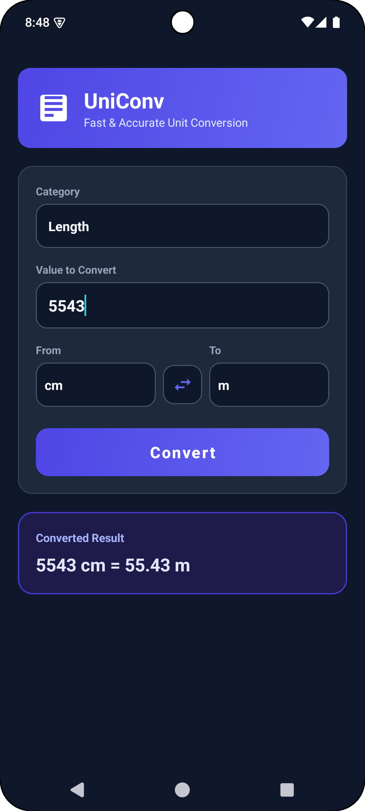
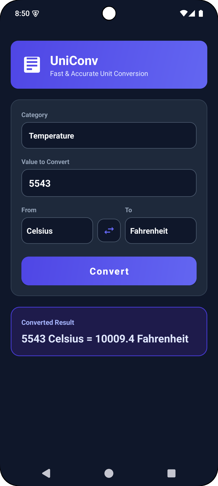

<div align="center">

# 🚀 UniConv – Unit Converter Application

**A sleek, dark-themed, and high-performance Android unit conversion app built for Rakamanda Maheswara Rao.**

[](https://developer.android.com)
[](https://www.java.com)
[](https://m3.material.io)
[](https://gradle.org)

</div>

---

## 📌 Overview

**UniConv** is a native Android application engineered as part of the **Oasis Infobyte Internship (Task 1 – Android App Development)**. 

The application offers fast, precise, and multi-category unit conversions across **Length**, **Weight**, and **Temperature**. Built using **Java** and **XML layouts**, UniConv delivers a modern dark theme experience, complete with system status bar inset padding to prevent layout clipping, dynamic unit swap capabilities, and custom-styled dropdown popups.

---

## ✨ Key Features & Capabilities

- 📏 **Length Conversions:** Instant conversion between Centimeters (`cm`), Meters (`m`), and Inches (`inch`).
- ⚖️ **Weight Conversions:** Seamless conversion between Grams (`g`), Kilograms (`kg`), and Pounds (`pound`).
- 🌡️ **Temperature Conversions:** Precise formulas across Celsius (`°C`), Fahrenheit (`°F`), and Kelvin (`K`).
- 🔄 **One-Tap Unit Swap:** Swap source and target units instantly with automated re-calculation.
- 🛡️ **Comprehensive Input Validation:** Friendly Toast notifications for empty inputs, non-numeric strings, negative length/weight values, or temperatures below absolute zero (-273.15°C / 0K).
- 🌙 **Modern Dark UI Design:** Custom dark palette (`#0F172A` Slate background, `#1E293B` card surfaces, `#6366F1` indigo highlights).
- 📱 **System Window Insets Handling:** Dynamic status bar padding so top headers never overlap system status bar icons or notch cutouts.
- 🎨 **Custom Dropdown Styling:** Non-flat dropdown popup menus with rounded corners (`14dp`), dark containers, and high-contrast text.

---

## 🛠️ Tech Stack & Architecture

| Component | Technology / Library | Description |
| :--- | :--- | :--- |
| **Language** | Java (JDK 11) | Core application logic and unit conversion algorithms |
| **UI Framework** | Android XML & Material Components | `ConstraintLayout`, `ScrollView`, Material Spinners, Buttons & Cards |
| **Theme & Style** | Dark Mode Palette | Custom tokenized color system (`colors.xml`, `themes.xml`) |
| **Window Insets** | `androidx.core.view.ViewCompat` | Dynamic status bar inset padding handling |
| **Minification** | RGuard / ProGuard (R8) | Rules for preserving reflection, layout inflation & Activity entry points |
| **Build System** | Gradle 9.3 (AGP 9.3.0) | Android Application Gradle Plugin with Version Catalog (`libs.versions.toml`) |

---

## 📂 Project Structure

```text
OIBSIP/
 └── Android-Task1-UnitConverter/
     ├── assets/
     │   ├── cm_to_m.png                      # Length conversion preview screenshot
     │   ├── g_to_kg.png                      # Weight conversion preview screenshot
     │   └── c_to_f.png                       # Temperature conversion preview screenshot
     ├── app/
     │   ├── proguard-rules.pro               # ProGuard / R8 optimization & keep rules
     │   └── src/main/
     │       ├── AndroidManifest.xml          # Application manifest file
     │       ├── java/com/maheswara660/uniconv/
     │       │   └── MainActivity.java        # Core conversion logic, validation & inset listener
     │       └── res/
     │           ├── drawable/                # Custom card, button, spinner & icon drawables
     │           │   ├── bg_card.xml
     │           │   ├── bg_result_card.xml
     │           │   ├── bg_input_field.xml
     │           │   ├── bg_button.xml
     │           │   ├── bg_spinner_popup.xml
     │           │   ├── ic_swap.xml
     │           │   └── ic_converter.xml
     │           ├── layout/                  # Activity & custom spinner layout files
     │           │   ├── activity_main.xml
     │           │   ├── spinner_item.xml
     │           │   └── spinner_dropdown_item.xml
     │           └── values/                  # Strings, colors, and dark theme definitions
     │               ├── colors.xml
     │               ├── strings.xml
     │               └── themes.xml
     ├── build.gradle.kts                     # Root build configuration
     ├── gradle/libs.versions.toml            # Gradle Version Catalog
     └── README.md                            # Comprehensive project documentation
```

---

## 📸 Screenshots & Demonstration

| 📏 1. Length Conversion | ⚖️ 2. Weight Conversion | 🌡️ 3. Temperature Conversion |
| :---: | :---: | :---: |
|  |  |  |
| *Centimeters to Meters (`100 cm = 1 m`)* | *Grams to Kilograms (`1000 g = 1 kg`)* | *Celsius to Fahrenheit (`25 °C = 77 °F`)* |

---

## 📲 Local Installation & Setup

1. **Clone the Repository:**
   ```bash
   git clone https://github.com/Maheswara660/OIBSIP.git
   cd OIBSIP/Android-Task1-UnitConverter
   ```

2. **Build Debug APK:**
   ```bash
   ./gradlew assembleDebug
   ```
   The compiled APK will be located at:  
   `app/build/outputs/apk/debug/app-debug.apk`

3. **Install on Connected Device / Emulator:**
   ```bash
   ./gradlew installDebug
   ```

---

## 🛡️ ProGuard / R8 Configuration

The application includes dedicated optimization rules in [`app/proguard-rules.pro`](app/proguard-rules.pro):
- Preserves `MainActivity` entry points and manifest-bound class definitions.
- Keeps AndroidX AppCompat and Material Component widget constructors for smooth XML inflation.
- Preserves line numbers (`LineNumberTable`) and source files for diagnostic stack trace reporting.

---

## 📜 Internship Task Compliance

This project satisfies all requirements for **Task 1 – Unit Converter Application** under the **Oasis Infobyte Internship Program**:
- ✅ Built strictly in **Java** with **XML layouts**.
- ✅ Features `EditText` input, two `Spinner`s for unit selection, `Button` labeled "Convert", and result `TextView`.
- ✅ Implemented **Length** (cm ↔ m ↔ inch), **Weight** (kg ↔ g ↔ pound), and **Temperature** (Celsius ↔ Fahrenheit ↔ Kelvin).
- ✅ Input validation with user-friendly Toast notifications.
- ✅ Displayed converted values with attached unit labels.

---

## 📌 Author

**Rakamanda Maheswara Rao**  
Final-year Computer Science & Engineering Student  
Visakhapatnam, India  
GitHub: [@Maheswara660](https://github.com/Maheswara660)
