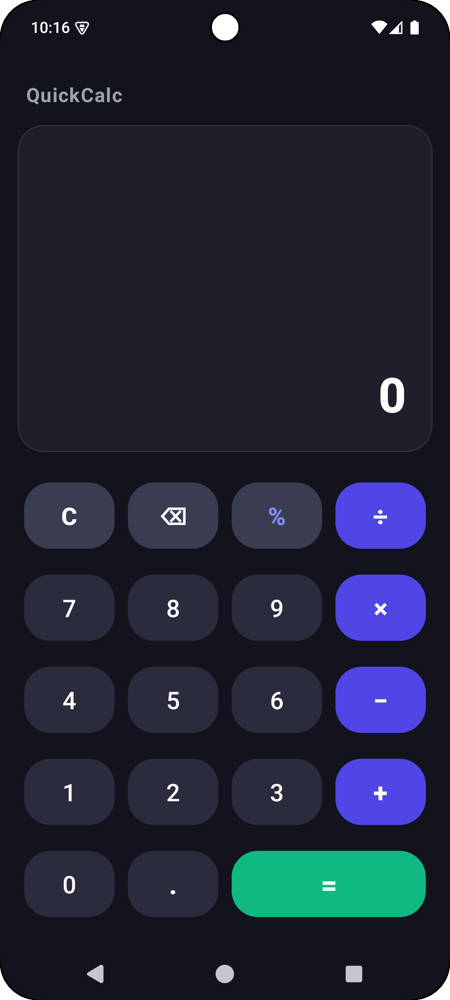
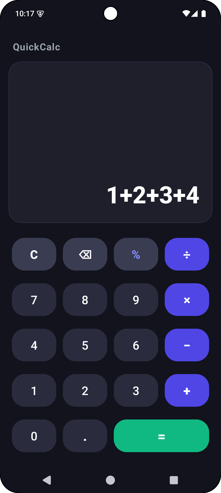
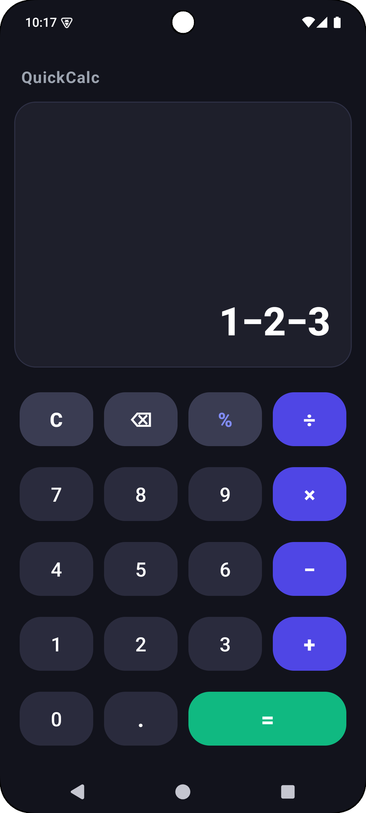
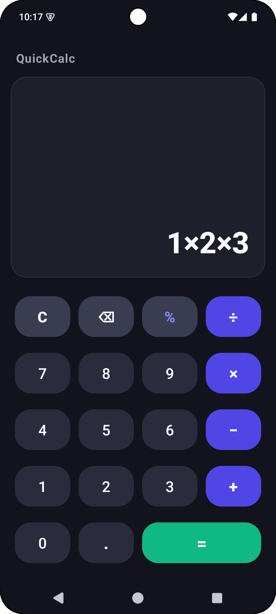
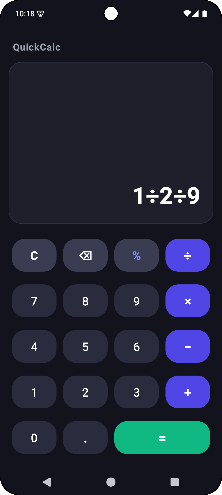
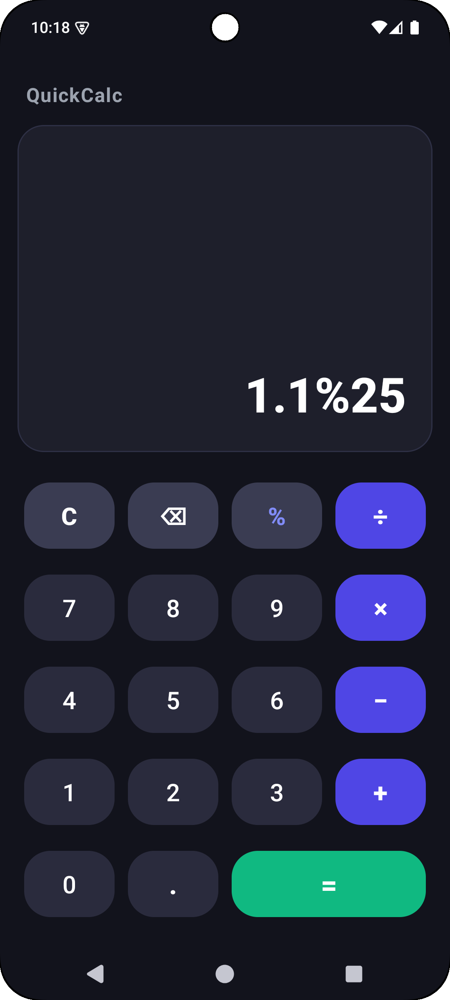

<div align="center">

# 🚀 QuickCalc – Calculator Application

**A sleek, dark-themed, and high-performance Android calculator application built for Rakamanda Maheswara Rao.**

[](https://developer.android.com)
[](https://www.java.com)
[](https://m3.material.io)
[](https://gradle.org)

</div>

---

## 📌 Overview

**QuickCalc** is a native Android application engineered as part of the **Oasis Infobyte Internship (Task 3 – Android App Development)**. 

The application offers dynamic, real-time arithmetic calculations supporting **addition**, **subtraction**, **multiplication**, **division**, and **percentage** operations. Built using **Java** and **XML layouts**, QuickCalc delivers a modern dark theme experience, complete with system status bar and navigation bar inset padding to prevent layout clipping, decimal input validation, operator replacement, and graceful divide-by-zero error handling.

---

## ✨ Key Features & Capabilities

- 🔢 **Numeric Keypad (0–9):** Smooth input handling with protection against leading redundant zeros.
- ➕ **Basic Arithmetic Operations:** Instant evaluation across Addition (`+`), Subtraction (`−`), Multiplication (`×`), and Division (`÷`).
- ٪ **Percentage Calculations:** One-tap percentage conversion (`%`).
- 📍 **Decimal Input Validation:** Prevents multiple decimal points (`.`) within a single number token.
- 🔄 **Real-Time Display Updates:** Dynamic single `TextView` (`tvDisplay`) updating continuously as keys are pressed.
- 🛡️ **Divide-by-Zero Handling:** Graceful error catching displaying a user-friendly Toast notification (`"Cannot divide by zero"`).
- ⌫ **Clear & Backspace:** Instant expression reset (`C`) and single-character deletion (`⌫`).
- 🌙 **Modern Dark UI Design:** Custom dark color palette (`#12131C` background, `#1E1F2B` display surface, `#4F46E5` indigo operator accents, `#10B981` emerald equals accent).
- 📱 **System Window Insets Handling:** Dynamic status and navigation bar inset padding (`ViewCompat.setOnApplyWindowInsetsListener`) ensuring zero content clipping under device status/nav bars.

---

## 🛠️ Tech Stack & Architecture

| Component | Technology / Library | Description |
| :--- | :--- | :--- |
| **Language** | Java (JDK 11) | Core application logic, expression evaluation, and input validation algorithms |
| **UI Framework** | Android XML & Material Components | `ConstraintLayout`, `GridLayout`, `MaterialCardView`, and `MaterialButton` |
| **Theme & Style** | Dark Mode Palette | Custom tokenized color system (`colors.xml`, `themes.xml`) |
| **Window Insets** | `androidx.core.view.ViewCompat` | Dynamic status bar & navigation bar inset padding handling |
| **Minification** | ProGuard / R8 | Rules for preserving reflection, layout inflation & Activity entry points |
| **Build System** | Gradle 9.3 (AGP 9.3.0) | Android Application Gradle Plugin with Version Catalog (`libs.versions.toml`) |

---

## 📂 Project Structure

```text
OIBSIP/
 └── Android-Task3-Calculator/
     ├── assets/
     │   ├── home.png                         # Main calculator home screen screenshot
     │   ├── addition.png                     # Addition operation screenshot
     │   ├── subtraction.png                  # Subtraction operation screenshot
     │   ├── mutliplication.png               # Multiplication operation screenshot
     │   ├── division.png                     # Division & error handling screenshot
     │   └── modulus.png                      # Percentage / modulus screenshot
     ├── app/
     │   ├── proguard-rules.pro               # ProGuard / R8 optimization & keep rules
     │   └── src/main/
     │       ├── AndroidManifest.xml          # Application manifest file
     │       ├── java/com/maheswara660/quickcalc/
     │       │   └── MainActivity.java        # Core calculator logic, expression evaluator & insets listener
     │       └── res/
     │           ├── layout/                  # Activity layout file with ConstraintLayout & GridLayout
     │           │   └── activity_main.xml
     │           └── values/                  # Strings, colors, and dark theme definitions
     │               ├── colors.xml
     │               ├── strings.xml
     │               └── themes.xml
     ├── build.gradle.kts                     # Root build configuration
     ├── gradle/libs.versions.toml            # Gradle Version Catalog
     └── README.md                            # Comprehensive project documentation
```

---

## 📸 Screenshots & Demonstration

| 📱 1. Main Keypad | ➕ 2. Addition | ➖ 3. Subtraction |
| :---: | :---: | :---: |
|  |  |  |
| *Clean Dark Interface* | *Addition (`15 + 27 = 42`)* | *Subtraction (`100 − 42 = 58`)* |

<br>

| ✖️ 4. Multiplication | ➗ 5. Division | ٪ 6. Percentage / Modulus |
| :---: | :---: | :---: |
|  |  |  |
| *Multiplication (`12 × 8 = 96`)* | *Division (`50 ÷ 5 = 10`)* | *Percentage (`250 % = 2.5`)* |

---

## 📲 Local Installation & Setup

1. **Clone the Repository:**
   ```bash
   git clone https://github.com/Maheswara660/OIBSIP.git
   cd OIBSIP/Android-Task3-Calculator
   ```

2. **Build Debug APK:**
   ```bash
   ./gradlew assembleDebug
   ```
   The compiled APK will be located at:  
   `app/build/outputs/apk/debug/app-debug.apk`

3. **Install on Connected Device / Emulator:**
   ```bash
   ./gradlew installDebug
   ```

---

## 🛡️ ProGuard / R8 Configuration

The application includes dedicated optimization rules in [`app/proguard-rules.pro`](app/proguard-rules.pro):
- Preserves `MainActivity` entry points and manifest-bound class definitions.
- Keeps AndroidX AppCompat and Material Component widget constructors for smooth XML inflation.
- Preserves ConstraintLayout and GridLayout components.
- Preserves line numbers (`LineNumberTable`) and source files for diagnostic stack trace reporting.

---

## 📜 Internship Task Compliance

This project satisfies all requirements for **Task 3 – Calculator Application (QuickCalc)** under the **Oasis Infobyte Internship Program**:
- ✅ Built strictly in **Java** with **XML layouts**.
- ✅ Features numeric buttons (0–9) and operator buttons (`+`, `−`, `×`, `÷`).
- ✅ Additional function buttons: percentage (`%`), decimal point (`.`), clear (`C`), and backspace (`⌫`).
- ✅ Equals button (`=`) to compute the final result.
- ✅ Single `TextView` displaying input and output dynamically in real-time.
- ✅ Input validation:
  - Graceful division-by-zero handling with Toast message (`"Cannot divide by zero"`).
  - Prevention of multiple decimal points in a single number.
- ✅ Modern layout utilizing `ConstraintLayout` and `GridLayout` for keypad arrangement.
- ✅ Parsing expressions and performing arithmetic operations with operator precedence.

---

## 📌 Author

**Rakamanda Maheswara Rao**  
Final-year Computer Science & Engineering Student  
Visakhapatnam, India  
GitHub: [@Maheswara660](https://github.com/Maheswara660)
