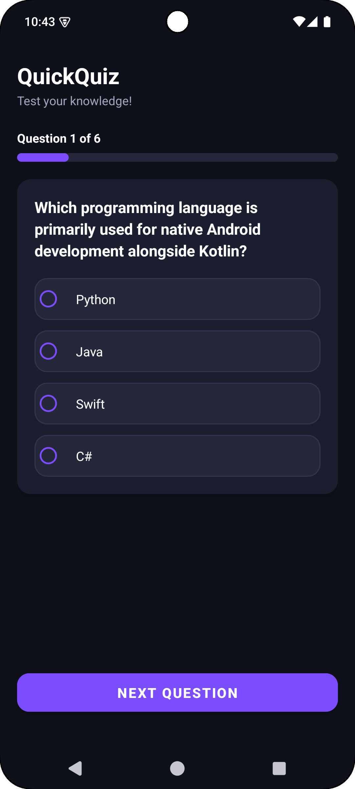
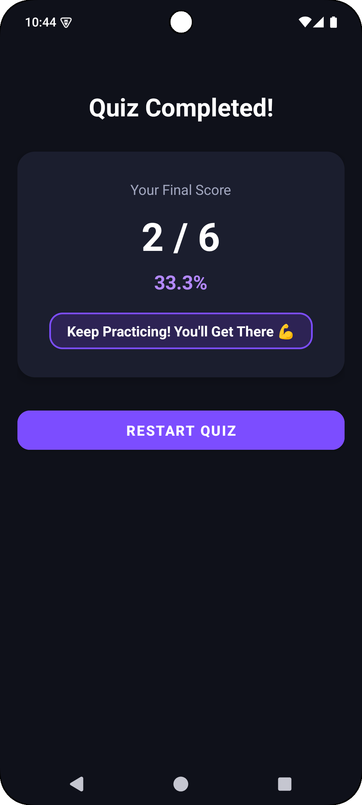

<div align="center">

# 🚀 QuickQuiz – Quiz Application

**A sleek, dark-themed, and high-performance Android quiz application built for Rakamanda Maheswara Rao.**

[](https://developer.android.com)
[](https://www.java.com)
[](https://m3.material.io)
[](https://gradle.org)

</div>

---

## 📌 Overview

**QuickQuiz** is a native Android application engineered as part of the **Oasis Infobyte Internship (Task 4 – Android App Development)**. 

The application offers an interactive, multiple-choice quiz experience complete with progress tracking, score calculation, option selection validation, dynamic feedback badges, and quiz replay capability. Built using **Java** and **XML layouts**, QuickQuiz delivers a modern dark theme experience, complete with system status bar and navigation bar inset padding to prevent layout clipping, smooth view transitions, and custom-styled radio option cards.

---

## ✨ Key Features & Capabilities

- ❓ **Multiple-Choice Questions:** Curated technical & general knowledge questions with 4 choices (`RadioButtons`) each.
- 📊 **Real-Time Progress Tracking:** Dynamic progress counter (`Question X of Y`) and custom-styled horizontal `ProgressBar`.
- 🛡️ **Option Selection Input Validation:** Enforces single-option selection before advancing, displaying a user-friendly Toast notification (`"Please select an option before moving to the next question!"`) if unselected.
- 🎯 **Score Tracking & Percentage Calculation:** Tracks correct answers dynamically and calculates exact final percentage scores (e.g. `83.3%`).
- 🏆 **Result Summary & Dynamic Feedback:** End-of-quiz screen featuring total score breakdown (`X / Y`), percentage score, and dynamic performance rating badges (*"Outstanding! Master Level 🌟"*).
- 🔄 **One-Tap Quiz Restart:** "Restart Quiz" button enabling instant state reset and quiz replay without app restart.
- 🌙 **Modern Dark UI Design:** Custom dark color palette (`#0F111A` slate-dark background, `#1B1E2E` card surfaces, `#7C4DFF` purple accent, `#25283B` option containers).
- 📱 **System Window Insets Handling:** Dynamic status and navigation bar inset padding (`ViewCompat.setOnApplyWindowInsetsListener`) ensuring zero content clipping under device status/nav bars or camera cutouts.

---

## 🛠️ Tech Stack & Architecture

| Component | Technology / Library | Description |
| :--- | :--- | :--- |
| **Language** | Java (JDK 11) | Core application logic, question data models, score calculator & validation algorithms |
| **UI Framework** | Android XML & Material Components | `ConstraintLayout`, `ScrollView`, `MaterialCardView`, `MaterialButton`, `RadioGroup` & `RadioButton` |
| **Theme & Style** | Dark Mode Palette | Custom tokenized color system (`colors.xml`, `themes.xml`, state selectors) |
| **Window Insets** | `androidx.core.view.ViewCompat` | Dynamic status bar & navigation bar inset padding handling |
| **Minification** | ProGuard / R8 | Rules for preserving data model, reflection, layout inflation & Activity entry points |
| **Build System** | Gradle 9.3 (AGP 9.3.0) | Android Application Gradle Plugin with Version Catalog (`libs.versions.toml`) |

---

## 📂 Project Structure

```text
OIBSIP/
 └── Android-Task4-QuizApp/
     ├── assets/
     │   ├── quiz.png                         # Quiz question screen preview screenshot
     │   └── result.png                       # Quiz result summary screen preview screenshot
     ├── app/
     │   ├── proguard-rules.pro               # ProGuard / R8 optimization & keep rules
     │   └── src/main/
     │       ├── AndroidManifest.xml          # Application manifest file
     │       ├── java/com/maheswara660/quickquiz/
     │       │   ├── Question.java            # POJO model for question text, choices & answer index
     │       │   └── MainActivity.java        # Quiz controller, insets listener, validation & scoring logic
     │       └── res/
     │           ├── drawable/                # Custom drawables for option selection & progress bar
     │           │   ├── bg_option_normal.xml
     │           │   ├── bg_option_selected.xml
     │           │   ├── bg_option_selector.xml
     │           │   └── bg_progress.xml
     │           ├── layout/                  # Activity layout file with ConstraintLayout & ScrollView
     │           │   └── activity_main.xml
     │           └── values/                  # Strings, colors, and dark theme definitions
     │               ├── colors.xml
     │               ├── strings.xml
     │               └── themes.xml
     ├── build.gradle.kts                     # Root build configuration
     ├── gradle/libs.versions.toml            # Gradle Version Catalog
     └── README.md                            # Comprehensive project documentation
```

---

## 📸 Screenshots & Demonstration

| ❓ 1. Active Quiz Screen | 🏆 2. Result Summary Screen |
| :---: | :---: |
|  |  |
| *Question Card, Options & Progress Bar* | *Final Score, Percentage & Dynamic Rating* |

---

## 📲 Local Installation & Setup

1. **Clone the Repository:**
   ```bash
   git clone https://github.com/Maheswara660/OIBSIP.git
   cd OIBSIP/Android-Task4-QuizApp
   ```

2. **Build Debug APK:**
   ```bash
   ./gradlew assembleDebug
   ```
   The compiled APK will be located at:  
   `app/build/outputs/apk/debug/app-debug.apk`

3. **Install on Connected Device / Emulator:**
   ```bash
   ./gradlew installDebug
   ```

---

## 🛡️ ProGuard / R8 Configuration

The application includes dedicated optimization rules in [`app/proguard-rules.pro`](app/proguard-rules.pro):
- Preserves `MainActivity` entry points and manifest-bound class definitions.
- Keeps `Question` POJO model class for data reflection/serialization safety.
- Keeps AndroidX AppCompat and Material Component widget constructors for smooth XML inflation.
- Preserves ConstraintLayout components.
- Preserves line numbers (`LineNumberTable`) and source files for diagnostic stack trace reporting.

---

## 📜 Internship Task Compliance

This project satisfies all requirements for **Task 4 – Quiz Application (QuickQuiz)** under the **Oasis Infobyte Internship Program**:
- ✅ Built strictly in **Java** with **XML layouts**.
- ✅ Features 6 hardcoded multiple-choice questions in a list/array.
- ✅ Each question has 4 options (`RadioButton` choices).
- ✅ One "Next" button to move to the next question.
- ✅ Score tracking (increments when correct answer is selected).
- ✅ Shows a Result screen at the end with final score (`X / Y`) and calculated percentage.
- ✅ Provides a "Restart Quiz" button to replay.
- ✅ Input validation: Ensures user selects an option before moving to next question (displays Toast warning if unselected).
- ✅ Minimal, clean layout using `ConstraintLayout` and `MaterialCardView`.

---

## 📌 Author

**Rakamanda Maheswara Rao**  
Final-year Computer Science & Engineering Student  
Visakhapatnam, India  
GitHub: [@Maheswara660](https://github.com/Maheswara660)
