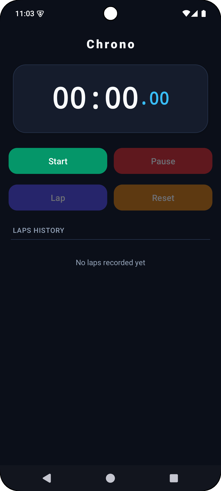
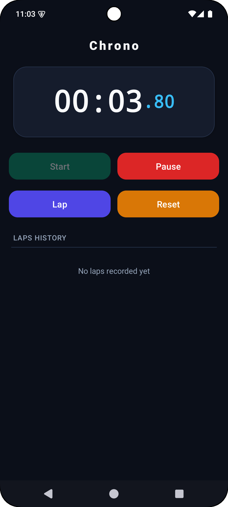
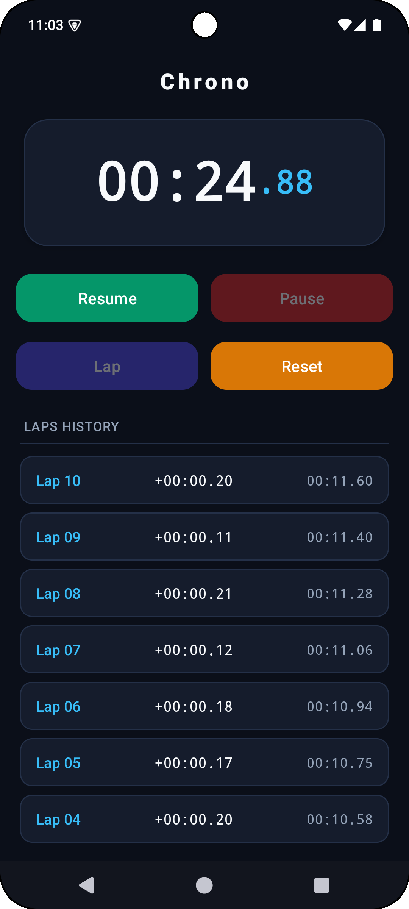
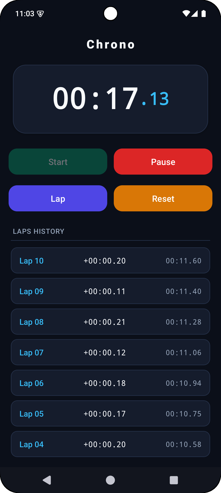

<div align="center">

# ⏱️ Chrono – Stopwatch Application

**A minimalist, high-precision dark-themed Android Stopwatch application built for Rakamanda Maheswara Rao.**

[](https://developer.android.com)
[](https://www.java.com)
[](https://m3.material.io)
[](https://gradle.org)

</div>

---

## 📌 Overview

**Chrono** is a native Android application engineered as **Task 5 (Stopwatch Application)** under the **Oasis Infobyte Internship Program (OIBSIP)**.

The application provides a high-precision, real-time stopwatch experience featuring split-lap timing, dynamic state management, input validation, and clear lap history tracking. Built using **Java** and **XML layouts**, Chrono features an ultra-dark modern UI theme with full system bar window inset padding to prevent layout clipping on devices with status bar notches or gesture navigation bars.

---

## ✨ Key Features & Capabilities

- ⏱️ **High-Precision Timing:** Uses `android.os.Handler` with `Runnable` and `SystemClock.elapsedRealtime()` for 60 FPS millisecond precision updates (`MM:SS.ss`).
- ▶️ **Start & Resume:** Begins timing immediately; seamlessly resumes from paused state without losing elapsed milliseconds.
- ⏸️ **Pause Timer:** Temporarily freezes the timer while retaining current elapsed duration.
- 🔄 **Reset Validation:** Clears the elapsed timer back to `00:00.00` and flushes all recorded laps from memory.
- 🚩 **Lap Time Recording:** Captures split time intervals (time since previous lap) and total cumulative time, displaying them dynamically in a `RecyclerView`.
- 🛡️ **Graceful State Safety:** Enforces strict button state toggling (Start, Pause, Lap, Reset) to prevent duplicate thread execution or invalid state calls.
- 🌙 **Modern Dark Obsidian UI:** Crafted with a dark slate palette (`#0B0F19` background, `#151C2C` card surfaces, `#38BDF8` cyan accents, `#10B981` start green, `#EF4444` pause red).
- 📱 **System Window Insets Handling:** Uses `ViewCompat.setOnApplyWindowInsetsListener` to dynamically adjust padding for system status bar and gesture navigation bar.

---

## 🛠️ Tech Stack & Architecture

| Component | Technology / Library | Description |
| :--- | :--- | :--- |
| **Language** | Java (JDK 11) | Core stopwatch controller logic, timer thread handler, lap state manager |
| **UI Framework** | Android XML & Material Components | `ConstraintLayout`, `MaterialCardView`, `MaterialButton`, `RecyclerView` |
| **Timing Engine** | `android.os.Handler` & `SystemClock` | Smooth, high-precision millisecond timing updates (~60 FPS) |
| **Window Insets** | `androidx.core.view.ViewCompat` | Edge-to-edge status bar & navigation bar inset padding |
| **Minification** | ProGuard / R8 | Custom keep rules for activity entry points, views & data models |
| **Build System** | Gradle 9.3 (AGP 9.3.0) | Android Application Gradle Plugin with Version Catalog (`libs.versions.toml`) |

---

## 📂 Project Structure

```text
OIBSIP/
 └── Android-Task5-Stopwatch/
     ├── assets/
     │   ├── home.png                         # Initial stopwatch screen screenshot
     │   ├── timer.png                        # Active running timer screenshot
     │   ├── paused.png                       # Paused state screenshot
     │   └── history.png                      # Recorded lap history list screenshot
     ├── app/
     │   ├── proguard-rules.pro               # ProGuard / R8 optimization & keep rules
     │   └── src/main/
     │       ├── AndroidManifest.xml          # Application manifest file
     │       ├── java/com/maheswara660/chrono/
     │       │   ├── LapItem.java             # Data model for lap number, split time & total time
     │       │   ├── LapAdapter.java          # RecyclerView Adapter for lap rows
     │       │   └── MainActivity.java        # Stopwatch handler logic, UI controller & state machine
     │       └── res/
     │           ├── layout/                  # XML layout files
     │           │   ├── activity_main.xml    # Main ConstraintLayout with timer & control grid
     │           │   └── item_lap.xml         # Lap list item card view layout
     │           └── values/                  # Strings, dark colors, and theme definitions
     │               ├── colors.xml
     │               ├── strings.xml
     │               └── themes.xml
     ├── build.gradle.kts                     # Root build configuration
     ├── gradle/libs.versions.toml            # Gradle Version Catalog
     └── README.md                            # Comprehensive project documentation
```

---

## 📸 Screenshots & Demonstration

| 🏠 1. Home / Initial State | ⏱️ 2. Active Running Timer |
| :---: | :---: |
|  |  |
| *Initial Reset State (`00:00.00`)* | *Live Running Timer Screen* |

| ⏸️ 3. Paused State | 📜 4. Lap History Recorded |
| :---: | :---: |
|  |  |
| *Paused State with Resume Option* | *Recorded Lap Times List* |

---

## 📲 Local Installation & Setup

1. **Clone the Repository:**
   ```bash
   git clone https://github.com/Maheswara660/OIBSIP.git
   cd OIBSIP/Android-Task5-Stopwatch
   ```

2. **Build Debug APK:**
   ```bash
   ./gradlew assembleDebug
   ```
   The compiled debug APK will be generated at:  
   `app/build/outputs/apk/debug/app-debug.apk`

3. **Build Release APK with R8 / ProGuard Minification:**
   ```bash
   ./gradlew assembleRelease
   ```

4. **Install on Connected Device / Emulator:**
   ```bash
   ./gradlew installDebug
   ```

---

## 🛡️ ProGuard / R8 Configuration

The application includes dedicated optimization rules in [`app/proguard-rules.pro`](app/proguard-rules.pro):
- Preserves `MainActivity` entry points and manifest-bound class definitions.
- Keeps `LapItem` POJO data model for data reflection and serialization safety.
- Keeps `LapAdapter` and `LapViewHolder` classes for RecyclerView item inflation.
- Keeps AndroidX AppCompat and Material Component widget constructors for smooth XML inflation.
- Preserves line numbers (`LineNumberTable`) and source files for crash diagnosis.

---

## 📜 Task 5 Compliance

This project fulfills all requirements for **Task 5 – Stopwatch Application (Chrono)** under the **Oasis Infobyte Internship Program**:
- ✅ Built strictly in **Java** with **XML layouts**.
- ✅ Features a **Start button** to begin timing.
- ✅ Features a **Pause button** to pause timing temporarily.
- ✅ Features a **Reset button** to reset elapsed time back to `00:00.00` and clear lap history.
- ✅ Features a **Lap button** to record lap times in a list.
- ✅ Display screen shows elapsed time in minutes, seconds, and milliseconds dynamically.
- ✅ Implements timing using `Handler` and `Runnable`.
- ✅ Stores lap times in an `ArrayList` and displays them in a `RecyclerView`.
- ✅ Input validation: Ensures reset clears both timer and lap list, and handles multiple start/pause presses gracefully.
- ✅ Minimal, clean layout using `ConstraintLayout`.
- ✅ Complete dark themed app with system navigation bar and status bar padding (`ViewCompat.setOnApplyWindowInsetsListener`).

---

## 📌 Author

**Rakamanda Maheswara Rao**  
Final-year Computer Science & Engineering Student  
Visakhapatnam, India  
GitHub: [@Maheswara660](https://github.com/Maheswara660)
