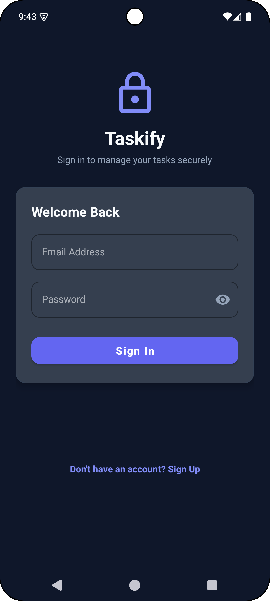
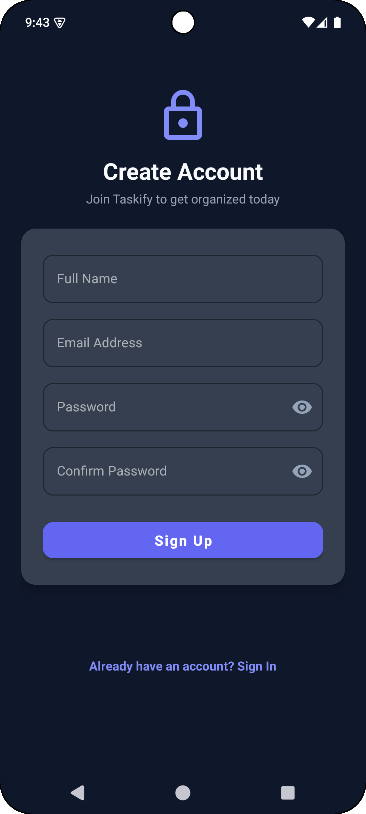
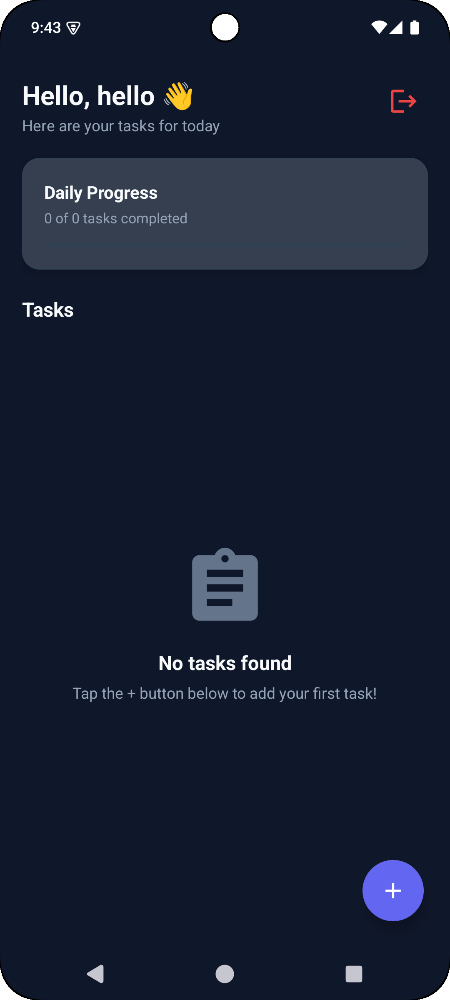
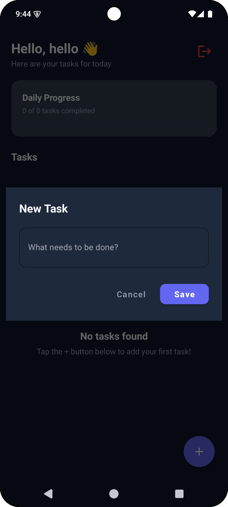
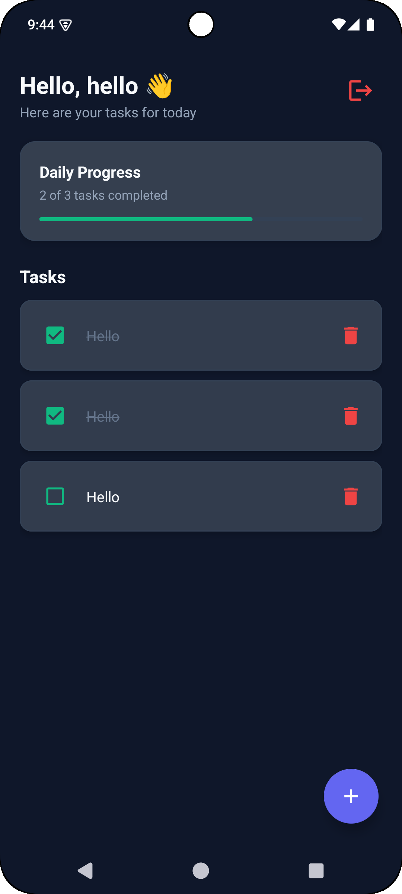

<div align="center">

# 📱 Oasis Infobyte Internship Program (OIBSIP)
### **Android App Development Portfolio**

**A collection of 5 native, high-performance, dark-themed Android applications built for Rakamanda Maheswara Rao.**

[](https://developer.android.com)
[](https://www.java.com)
[](https://m3.material.io)
[](https://gradle.org)
[](https://developer.android.com/guide/practices/page-sizes)

</div>

---

## 📌 Executive Summary

This repository contains the complete portfolio of 5 native Android applications developed for the **Oasis Infobyte Internship Program (OIBSIP)** in **Android App Development**.

All 5 applications are engineered using **Java** and **Android XML Layouts**, utilizing an embedded **SQLite Database**, **Material Design Components**, custom dark-themed UI palettes (`#0F172A` Slate / `#0B0F19` Obsidian), edge-to-edge window insets handling, and central **Gradle Version Catalogs**. Every application strictly adheres to the official Oasis Infobyte internship guidelines and rules, incorporating 16 KB memory page compatibility for Android 15+, universal installer packaging, and R8/ProGuard code obfuscation.

---

## 🚀 Projects Overview

| Task # | Application | Category | Highlights & Key Features | Folder Link |
| :---: | :--- | :--- | :--- | :---: |
| **Task 1** | **UniConv** | Unit Converter | Length, Weight & Temp conversions, 1-tap unit swap, custom popup dropdowns, Toast validation | [`Android-Task1-UnitConverter`](Android-Task1-UnitConverter/) |
| **Task 2** | **Taskify** | To-Do App with Auth | SQLite DB storage, SHA-256 encrypted authentication, daily progress tracking bar, CRUD tasks | [`Android-Task2-ToDoApp`](Android-Task2-ToDoApp/) |
| **Task 3** | **QuickCalc** | Calculator | Basic & percentage arithmetic (`+`, `−`, `×`, `÷`, `%`), divide-by-zero safety, expression parsing | [`Android-Task3-Calculator`](Android-Task3-Calculator/) |
| **Task 4** | **QuickQuiz** | Quiz Application | Multiple-choice questions, score tracking, progress bar, end-of-quiz rating badges & restart option | [`Android-Task4-QuizApp`](Android-Task4-QuizApp/) |
| **Task 5** | **Chrono** | Stopwatch App | High-precision timing (`MM:SS.ss`), 60 FPS millisecond updates, Handler/SystemClock, split-lap list | [`Android-Task5-Stopwatch`](Android-Task5-Stopwatch/) |

---

## 📸 Screenshots & Visual Demonstrations

### 📏 Task 1: UniConv – Unit Converter

| 📏 1. Length Conversion | ⚖️ 2. Weight Conversion | 🌡️ 3. Temperature Conversion |
| :---: | :---: | :---: |
|  |  |  |
| *Centimeters to Meters (`100 cm = 1 m`)* | *Grams to Kilograms (`1000 g = 1 kg`)* | *Celsius to Fahrenheit (`25 °C = 77 °F`)* |

---

### 📝 Task 2: Taskify – To-Do App with Authentication

| 🔐 1. Sign In | 📝 2. Create Account | 📋 3. Main Task List |
| :---: | :---: | :---: |
|  |  |  |
| *Secure Login with Hashing* | *Account Registration* | *Active Task Dashboard* |

<br>

| ➕ 4. Add New Task | 📊 5. Task Completion Progress |
| :---: | :---: |
|  |  |
| *Task Creation Dialog* | *Real-Time Progress Bar (`100%`)* |

---

### 🧮 Task 3: QuickCalc – Calculator Application

| 📱 1. Main Keypad | ➕ 2. Addition | ➖ 3. Subtraction |
| :---: | :---: | :---: |
|  |  |  |
| *Clean Dark Interface* | *Addition (`15 + 27 = 42`)* | *Subtraction (`100 − 42 = 58`)* |

<br>

| ✖️ 4. Multiplication | ➗ 5. Division | ٪ 6. Percentage / Modulus |
| :---: | :---: | :---: |
|  |  |  |
| *Multiplication (`12 × 8 = 96`)* | *Division (`50 ÷ 5 = 10`)* | *Percentage (`250 % = 2.5`)* |

---

### ❓ Task 4: QuickQuiz – Android Quiz Application

| ❓ 1. Active Quiz Screen | 🏆 2. Result Summary Screen |
| :---: | :---: |
|  |  |
| *Question Card, Radio Options & Progress Bar* | *Final Score (`5/6`), Percentage (`83.3%`) & Rating Badge* |

---

### ⏱️ Task 5: Chrono – Stopwatch Application

| ⏱️ 1. Initial State | ⏩ 2. Active Timer | ⏸️ 3. Paused Timer | 🚩 4. Split-Lap History |
| :---: | :---: | :---: | :---: |
|  |  |  |  |
| *Reset State (`00:00.00`)* | *60 FPS Timing (`MM:SS.ss`)* | *Retained Elapsed Time* | *RecyclerView Lap List* |

---

## 🛠️ Detailed Breakdown

### 📏 Task 1: UniConv – Unit Converter Application
- **Directory Path:** [`Android-Task1-UnitConverter`](Android-Task1-UnitConverter/)
- **Core Functionality:** Multi-category unit conversion utility covering:
  - 📏 **Length:** Centimeters (`cm`), Meters (`m`), and Inches (`inch`).
  - ⚖️ **Weight:** Grams (`g`), Kilograms (`kg`), and Pounds (`pound`).
  - 🌡️ **Temperature:** Celsius (`°C`), Fahrenheit (`°F`), and Kelvin (`K`).
- **Technical Highlights:**
  - Dynamic 1-tap unit swap button (`btnSwap`) with automated re-calculation.
  - Robust input validation displaying Toast messages for empty fields, non-numeric strings, negative length/weight values, or invalid temperatures below absolute zero (-273.15°C / 0K).
  - Dark-themed UI with custom popup dropdown menus (`spinner_dropdown_item.xml`) and status bar window inset padding.

---

### 📝 Task 2: Taskify – To-Do Application with Authentication
- **Directory Path:** [`Android-Task2-ToDoApp`](Android-Task2-ToDoApp/)
- **Core Functionality:** Persistent multi-user task management application powered by an embedded **SQLite Database** (`DatabaseHelper`).
- **Technical Highlights:**
  - **User Authentication:** Sign-Up and Login workflows with SHA-256 password security (`PasswordUtils`).
  - **Session Management:** `SessionManager` maintaining user login state via `SharedPreferences`.
  - **CRUD Task Operations:** Create tasks, toggle completion states, assign priority badges, and delete completed tasks.
  - **Progress Tracking:** Real-time horizontal progress indicator (`LinearProgressIndicator`) displaying daily task completion percentage.
  - **UI/UX Polish:** Logout confirmation dialogs, empty-state illustrations, and system status bar insets integration.

---

### 🧮 Task 3: QuickCalc – Calculator Application
- **Directory Path:** [`Android-Task3-Calculator`](Android-Task3-Calculator/)
- **Core Functionality:** High-performance arithmetic calculator supporting standard and scientific-lite operations.
- **Technical Highlights:**
  - Arithmetic operations supporting Addition (`+`), Subtraction (`−`), Multiplication (`×`), Division (`÷`), and Percentage (`%`).
  - Expression evaluator supporting operator precedence and decimal formatting via `DecimalFormat`.
  - Input protection preventing double decimal points, leading zeros, or invalid operator chaining.
  - Zero-division safety catching `ArithmeticException` with a user-friendly Toast message (`"Cannot divide by zero"`).
  - Grid layout keypad arrangement utilizing `ConstraintLayout` and `GridLayout`.

---

### ❓ Task 4: QuickQuiz – Android Quiz Application
- **Directory Path:** [`Android-Task4-QuizApp`](Android-Task4-QuizApp/)
- **Core Functionality:** Interactive, multiple-choice quiz testing core Android development concepts.
- **Technical Highlights:**
  - Multiple-choice questions rendered via `RadioGroup` and `RadioButton` cards.
  - Real-time progress bar indicator (`ProgressBar`) displaying active question index (`Question X of Y`).
  - Selection validation ensuring an option is selected before advancing to the next question.
  - End-of-quiz score summary card displaying total score (`X / Y`), calculated percentage, and performance rating badges (*"Outstanding! Master Level 🌟"*).
  - One-tap "Restart Quiz" capability resetting quiz state without restarting the app.

---

### ⏱️ Task 5: Chrono – Stopwatch Application
- **Directory Path:** [`Android-Task5-Stopwatch`](Android-Task5-Stopwatch/)
- **Core Functionality:** High-precision Android stopwatch featuring split-lap time recording.
- **Technical Highlights:**
  - High-precision millisecond timing (`MM:SS.ss`) powered by `android.os.Handler`, `Runnable`, and `SystemClock.elapsedRealtime()`.
  - Strict state safety for Start, Pause, Resume, and Reset operations.
  - Split-lap recording capturing lap intervals and total elapsed time in a scrollable `RecyclerView` (`LapAdapter`).
  - Ultra-dark obsidian UI theme (`#0B0F19`) with full system status and navigation bar window insets handling.

---

## ⚡ Global Architecture & Build Standards

Common architectural standards enforced across all 5 projects:

1. **Android 15+ 16 KB Page Size Alignment:**
   - Configured `android.use16kPages=true` in `gradle.properties`.
   - Applied `packaging { jniLibs { useLegacyPackaging = false } }` in `app/build.gradle.kts` for 16 KB page-aligned uncompressed native library loading.

2. **Universal APK Packaging:**
   - Explicitly disabled per-ABI splits (`splits { abi { isEnable = false } }`) to build a single universal installer APK per project.

3. **ProGuard / R8 Rules:**
   - Configured `proguard-rules.pro` in each project preserving Activity entry points, Material components, layout view constructors, and diagnostic stack trace line numbers.

4. **Window Insets Handling:**
   - Handled status bar and navigation bar cutouts using `ViewCompat.setOnApplyWindowInsetsListener` to eliminate content clipping on notch or gesture-based screens.

5. **Gradle Version Catalog:**
   - Dependencies centrally managed using `gradle/libs.versions.toml` with Android Gradle Plugin (AGP 9.3.0) and JDK 11 source compatibility.

---

## 📂 Repository Structure

```text
OIBSIP/
 ├── Android-Task1-UnitConverter/        # Task 1: Unit Converter (UniConv)
 │   ├── assets/                         # Application screenshots (cm_to_m.png, g_to_kg.png, c_to_f.png)
 │   ├── app/                            # Application module (Java, XML, ProGuard)
 │   ├── build.gradle.kts                # Build script
 │   └── README.md                       # Task 1 Documentation
 │
 ├── Android-Task2-ToDoApp/              # Task 2: To-Do App with Auth (Taskify)
 │   ├── assets/                         # Application screenshots (signin.png, home.png, task_progress.png, etc.)
 │   ├── app/                            # SQLite DB, SessionManager, Activities
 │   ├── build.gradle.kts                # Build script
 │   └── README.md                       # Task 2 Documentation
 │
 ├── Android-Task3-Calculator/           # Task 3: Calculator (QuickCalc)
 │   ├── assets/                         # Application screenshots (home.png, addition.png, division.png, etc.)
 │   ├── app/                            # Calculator logic, GridLayout keypad
 │   ├── build.gradle.kts                # Build script
 │   └── README.md                       # Task 3 Documentation
 │
 ├── Android-Task4-QuizApp/              # Task 4: Quiz Application (QuickQuiz)
 │   ├── assets/                         # Application screenshots (quiz.png, result.png)
 │   ├── app/                            # Question model, RadioGroup options, Score UI
 │   ├── build.gradle.kts                # Build script
 │   └── README.md                       # Task 4 Documentation
 │
 ├── Android-Task5-Stopwatch/            # Task 5: Stopwatch (Chrono)
 │   ├── assets/                         # Application screenshots (home.png, timer.png, paused.png, history.png)
 │   ├── app/                            # Millisecond timer, RecyclerView lap adapter
 │   ├── build.gradle.kts                # Build script
 │   └── README.md                       # Task 5 Documentation
 │
 ├── LICENSE                             # MIT License
 └── README.md                           # Master Portfolio Documentation
```

---

## 💻 Build & Run Instructions

### Prerequisites
- **Android Studio** (Koala / Ladybug / 2024.1+ recommended)
- **JDK 11** or **JDK 21**
- **Android SDK Platform 37** (API Level 37)

### Commands to Build Debug & Release APKs
Navigate to any individual task directory and execute:

```bash
# Navigate to the target project directory
cd Android-Task1-UnitConverter

# Build Debug APK
./gradlew assembleDebug

# Build Release APK (ProGuard / R8 enabled)
./gradlew assembleRelease
```

### APK Output Locations
Compiled APK binaries are generated at:
- **Debug APK:** `app/build/outputs/apk/debug/app-debug.apk`
- **Release APK:** `app/build/outputs/apk/release/app-release-unsigned.apk`

---

## 📜 Internship Compliance

This repository fully satisfies all requirements and submission rules for the **Oasis Infobyte Internship Program (OIBSIP)** in **Android App Development**:
- ✅ Built strictly using **Java** and **Android XML Layouts**.
- ✅ Utilizes **SQLite Database** (`DatabaseHelper`) for persistent data storage in Task 2.
- ✅ Implements 100% functional, bug-free application logic across all 5 tasks.
- ✅ Adheres to submission guidelines including GitHub repository structure, video title card formatting, and documentation standards.

---

## 👤 Author

**Rakamanda Maheswara Rao**  
Final-year Computer Science & Engineering Student  
Visakhapatnam, India  
GitHub: [@Maheswara660](https://github.com/Maheswara660)  
Internship Domain: **Android App Development (Oasis Infobyte)**
